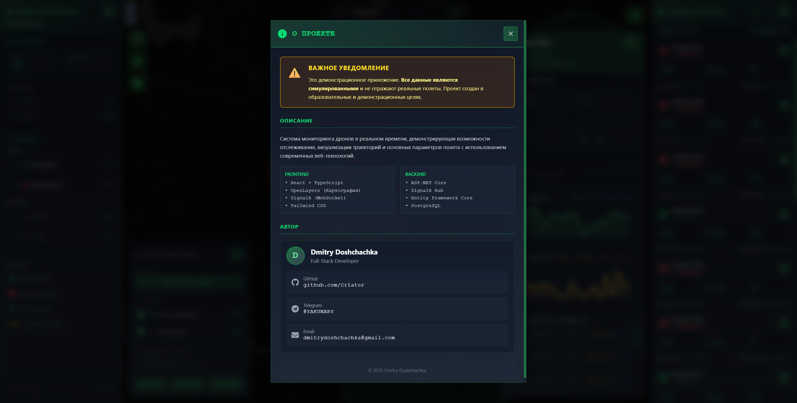
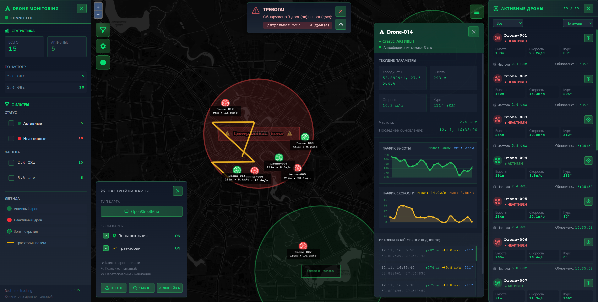
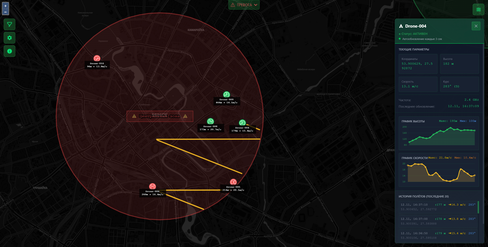
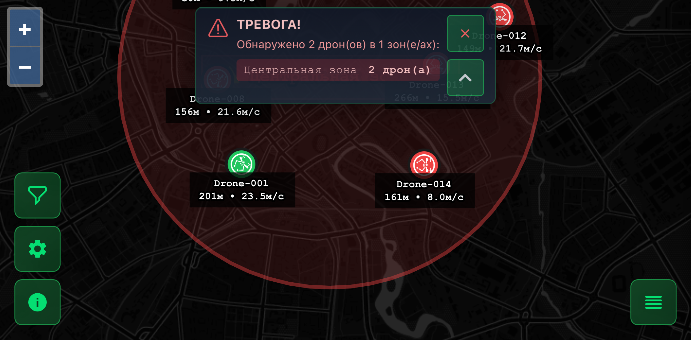

# 🚁 Drone Monitoring System

Веб-приложение для мониторинга дронов в реальном времени на интерактивной карте OpenStreetMap с телеметрией, симуляцией полетов и визуализацией зон покрытия.


## ✨ Основные возможности

- 🗺️ **Интерактивная карта** — OpenLayers с отображением дронов в реальном времени
- 📊 **Телеметрия** — координаты, высота, скорость, направление, частота связи
- 📈 **Графики истории** — визуализация параметров полета с помощью Chart.js
- 🎯 **Зоны покрытия** — отображение геозон с использованием PostGIS
- 🔄 **Real-time обновления** — SignalR для мгновенной синхронизации данных
- 🤖 **Симулятор** — автоматическая генерация динамических траекторий полетов
- 📏 **Инструменты карты** — измерение расстояний, масштабирование, управление слоями
- 🎨 **Адаптивный UI** — современный интерфейс на Tailwind CSS

## 🛠️ Технологический стек

### Backend

- **Framework**: ASP.NET Core 9.0
- **Database**: PostgreSQL 15+ с PostGIS (для геопространственных данных)
- **ORM**: Entity Framework Core 9.0
- **Real-time**: SignalR 9.0
- **Geospatial**: NetTopologySuite (NTS)

### Frontend

- **Framework**: React 19.1.1
- **Language**: TypeScript 5.9
- **Build Tool**: Vite 7.1 + SWC
- **UI**: Tailwind CSS 4.1
- **Maps**: OpenLayers 10.7 (rlayers 3.8)
- **Charts**: Chart.js 4.5 + react-chartjs-2
- **Icons**: React Icons 5.5
- **Real-time**: @microsoft/signalr 9.0

## 📦 Установка и запуск

### Требования

- .NET 9.0 SDK
- Node.js 20+ и npm
- PostgreSQL 15+ с расширением PostGIS

### Вариант 1: Локальный запуск

#### 1. Клонировать репозиторий

```bash
git clone https://github.com/Cr1ator/drone-monitoring.git
cd drone-monitoring
```

#### 2. Настроить базу данных PostgreSQL

```bash
# Создать БД
createdb drone_monitoring

# Или через Docker
docker run --name drone-postgres \
  -e POSTGRES_PASSWORD=postgres \
  -e POSTGRES_DB=drone_monitoring \
  -p 5432:5432 -d postgis/postgis:15-3.3
```

#### 3. Настроить переменные окружения

**Backend** — создайте `Server/appsettings.Development.json`:

```json
{
  "ConnectionStrings": {
    "DefaultConnection": "Host=localhost;Database=drone_monitoring;Username=postgres;Password=postgres"
  }
}
```

**Frontend** — создайте `Client/.env.local`:

```env
VITE_API_URL=http://localhost:5000
```

#### 4. Запустить Backend

```bash
cd Server
dotnet restore
dotnet run
```

Backend будет доступен на `http://localhost:5000`

#### 5. Запустить Frontend

```bash
cd Client
npm install
npm run dev
```

Frontend будет доступен на `http://localhost:5173`

### Вариант 2: Docker Compose

```bash
docker-compose up --build
```

Приложение будет доступно на:

- Frontend: `http://localhost:80`
- Backend API: `http://localhost:5000`

## 📁 Структура проекта

```
DroneMonitoringWeb/
│
├── Client/                                # React Frontend
│   ├── src/
│   │   ├── components/
│   │   │   ├── Map/
│   │   │   │   └── DroneMap.tsx          # Карта с OpenLayers
│   │   │   ├── DroneList.tsx             # Список дронов
│   │   │   ├── DroneInfoPanel.tsx        # Панель информации
│   │   │   ├── DroneHistoryPanel.tsx     # Графики телеметрии
│   │   │   ├── FilterPanel.tsx           # Фильтры
│   │   │   ├── MapControls.tsx           # Управление картой
│   │   │   ├── RulerControl.tsx          # Линейка для измерений
│   │   │   ├── RulerEditPanel.tsx        # Редактор линейки
│   │   │   └── AboutModal.tsx            # О проекте
│   │   ├── types/
│   │   │   └── drone.ts                  # TypeScript типы
│   │   ├── App.tsx
│   │   ├── main.tsx
│   │   └── index.css
│   ├── vite.config.ts
│   ├── package.json
│   ├── Dockerfile
│   └── nginx.conf
│
├── Server/                                # ASP.NET Core Backend
│   ├── Controllers/
│   │   └── DronesController.cs           # REST API endpoints
│   ├── Data/
│   │   └── ApplicationDbContext.cs       # EF Core DbContext + Models
│   ├── Hubs/
│   │   └── DroneTrackingHub.cs           # SignalR Hub
│   ├── Services/
│   │   └── DroneSimulatorService.cs      # Фоновый сервис симуляции
│   ├── Program.cs                        # Точка входа
│   ├── Dockerfile
│   └── DroneMonitoring.Server.csproj
│
├── DroneMonitoring.sln
├── docker-compose.yml
└── README.md
```

## 🗄️ Модель данных

### Drones

```typescript
{
  id: number;
  name: string; // "Drone-001"
  frequency: string; // "2.4 GHz" | "5.8 GHz"
  status: string; // "Active" | "Inactive"
  lastSeen: DateTime;
}
```

### Telemetry

```typescript
{
  id: number;
  droneId: number;
  latitude: number; // Широта WGS84
  longitude: number; // Долгота WGS84
  altitude: number; // Высота в метрах
  speed: number; // Скорость м/с
  heading: number; // Направление 0-360°
  timestamp: DateTime;
}
```

### CoverageZones

```typescript
{
  id: number;
  name: string;
  zone: Polygon; // PostGIS геометрия
  radiusMeters: number;
}
```

## 🌐 API Endpoints

### REST API

| Method | Endpoint                            | Описание                   |
| ------ | ----------------------------------- | -------------------------- |
| `GET`  | `/api/drones`                       | Получить все дроны         |
| `GET`  | `/api/drones/{id}`                  | Получить дрон по ID        |
| `GET`  | `/api/drones/{id}/telemetry`        | История телеметрии дрона   |
| `GET`  | `/api/drones/{id}/telemetry/latest` | Последняя телеметрия       |
| `GET`  | `/api/zones`                        | Получить все зоны покрытия |
| `GET`  | `/health`                           | Health check               |

### SignalR Hub

**Endpoint**: `/droneHub`

**Events**:

- `DroneLocationUpdated` — обновление позиции дрона
- `DroneTelemetryUpdated` — обновление телеметрии
- `DroneStatusChanged` — изменение статуса

**Пример использования**:

```typescript
const connection = new HubConnectionBuilder()
  .withUrl("http://localhost:5000/droneHub")
  .build();

connection.on("DroneLocationUpdated", (data) => {
  console.log("Drone updated:", data);
});

await connection.start();
```

## 📸 Скриншоты

<table>
  <tr>
    <td width="50%">
      <h3 align="center">📋 О проекте</h3>
      
      <p>Модальное окно с информацией о системе, технологиях и функционале</p>
    </td>
    <td width="50%">
      <h3 align="center">🗺️ Карта мониторинга</h3>
      
      <p>Интерактивная карта с отображением дронов, зон покрытия и маршрутов в реальном времени</p>
    </td>
  </tr>
  <tr>
    <td width="50%">
      <h3 align="center">📊 Панель телеметрии</h3>
      
      <p>Детальная информация о дроне: координаты, скорость, высота, частота связи и графики истории</p>
    </td>
    <td width="50%">
      <h3 align="center">📱 Мобильная версия</h3>
      
      <p>Адаптивный интерфейс для мониторинга дронов на мобильных устройствах</p>
    </td>
  </tr>
</table>

## 👨‍💻 Автор

**Cr1ator** — [GitHub](https://github.com/Cr1ator)

---

⭐ Если проект понравился, поставьте звезду!

```
## 🏷️ GitHub Metadata

**Description для GitHub**:
```

Real-time drone monitoring system with interactive OpenStreetMap, telemetry visualization, and flight simulation. Built with ASP.NET Core 9.0, React 19, PostgreSQL + PostGIS, SignalR, and OpenLayers.

```
**Topics для GitHub**:
```

drone-monitoring
real-time
aspnet-core
react
typescript
postgresql
postgis
signalr
openlayers
telemetry
geospatial
dotnet9
vite
tailwindcss
flight-tracking
webgis
fullstack
csharp
entity-framework-core

```
MIT License with Restrictions

Copyright (c) 2025 Cr1ator

Все права защищены.

Использование данного программного обеспечения (включая исходный код,
документацию и связанные материалы) разрешается только при наличии
письменного разрешения правообладателя.

Без явного разрешения автора запрещается:
- Использование в коммерческих целях
- Модификация исходного кода
- Распространение копий
- Включение в другие проекты

Для получения разрешения обращайтесь: https://github.com/Cr1ator

ПО ПРЕДОСТАВЛЯЕТСЯ «КАК ЕСТЬ», БЕЗ КАКИХ-ЛИБО ГАРАНТИЙ.
```
